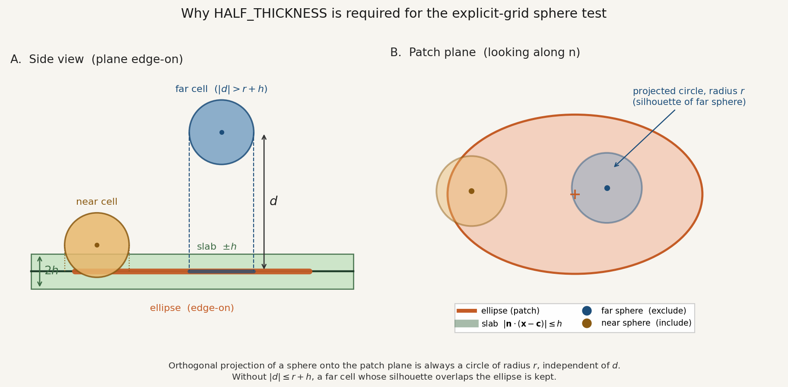

.. _planar-patch-theory:
.. _discretization-regions:

Planar Patch
============

A planar patch is a finite-thickness ellipse or rectangle lying in
an arbitrary plane. Control volumes that **intersect** the patch
are assigned to the region. The corresponding input card is
:ref:`planar-patch-region-card`.

Geometric definition
--------------------

Let :math:`\mathbf{c}` be the patch centroid, :math:`\mathbf{n}` a
unit normal to the plane, and
:math:`(\hat{\mathbf{e}}_1,\hat{\mathbf{e}}_2)` an orthonormal basis
in the plane with
:math:`\hat{\mathbf{e}}_2 = \mathbf{n}\times\hat{\mathbf{e}}_1`.
In-plane coordinates of a point :math:`\mathbf{x}` are

.. math::

   \xi = (\mathbf{x}-\mathbf{c})\cdot\hat{\mathbf{e}}_1, \qquad
   \eta = (\mathbf{x}-\mathbf{c})\cdot\hat{\mathbf{e}}_2, \qquad
   d = \mathbf{n}\cdot(\mathbf{x}-\mathbf{c}).

The patch of half-thickness :math:`h>0` and semi-axes :math:`a,b`
is the set of points satisfying

.. math::
   :label: planar-patch-set

   |d| \le h
   \quad\text{and}\quad
   \begin{cases}
   (\xi/a)^2 + (\eta/b)^2 \le 1 & \text{ellipse}, \\
   |\xi| \le a \;\text{and}\; |\eta| \le b & \text{rectangle}.
   \end{cases}

The first condition is a slab about the plane; the second is the
in-plane shape. Together they define a finite-aperture disk (or
panel), not an infinite plane.

Orientation
-----------

Two equivalent specifications of :math:`(\mathbf{n},\hat{\mathbf{e}}_1)`
are supported.

**Trace angles.** Let :math:`\theta_{xy}` be the map-view trace
(from :math:`+X` toward :math:`+Y`) and :math:`\theta_{xz}` the
XZ-section trace (from :math:`+X` toward :math:`+Z`), in degrees.
The trace directions are

.. math::

   \mathbf{u} = (\cos\theta_{xy},\;\sin\theta_{xy},\;0), \qquad
   \mathbf{v} = (\cos\theta_{xz},\;0,\;\sin\theta_{xz}).

Then

.. math::

   \mathbf{n} = \frac{\mathbf{u}\times\mathbf{v}}
                    {\lVert\mathbf{u}\times\mathbf{v}\rVert}, \qquad
   \hat{\mathbf{e}}_1 = \frac{\mathbf{u}}{\lVert\mathbf{u}\rVert}, \qquad
   \hat{\mathbf{e}}_2 = \mathbf{n}\times\hat{\mathbf{e}}_1.

Parallel traces (:math:`\lVert\mathbf{u}\times\mathbf{v}\rVert = 0`)
are rejected.

**Normal and axis.** Given a (not necessarily unit) normal
:math:`\mathbf{n}_0` and an in-plane seed :math:`\mathbf{a}`,

.. math::

   \mathbf{n} = \frac{\mathbf{n}_0}{\lVert\mathbf{n}_0\rVert}, \qquad
   \hat{\mathbf{e}}_1 =
     \frac{\mathbf{a}-(\mathbf{a}\cdot\mathbf{n})\mathbf{n}}
          {\lVert\mathbf{a}-(\mathbf{a}\cdot\mathbf{n})\mathbf{n}\rVert},
   \qquad
   \hat{\mathbf{e}}_2 = \mathbf{n}\times\hat{\mathbf{e}}_1.

:math:`\mathbf{a}` must not be parallel to :math:`\mathbf{n}`.

Cell–patch intersection
-----------------------

A control volume is assigned to the region if and only if it
**intersects** the set :eq:`planar-patch-set`. Cell-center
containment is not used: a cell whose centroid lies outside the
patch is still included if the patch cuts the cell.

Structured, implicit unstructured, and polyhedral cells
+++++++++++++++++++++++++++++++++++++++++++++++++++++++

The cell is treated as the convex hull of its vertices
:math:`\mathbf{v}_i`. Signed distances
:math:`d_i = \mathbf{n}\cdot(\mathbf{v}_i-\mathbf{c})` are formed.
If :math:`[d_{\min},d_{\max}]` does not overlap :math:`[-h,h]`, the
cell misses the slab.

Otherwise a clip point set is built **without face connectivity**:
every vertex with :math:`|d_i|\le h`, plus the intersection of
**every vertex pair** (not only mesh edges) that straddles
:math:`d=+h` or :math:`d=-h`. Those points are projected into
:math:`(\xi,\eta)` **in the order they were added**. The cell is
included if any of the following holds:

- a projected point lies in the ellipse or rectangle
- the patch origin :math:`(\xi,\eta)=(0,0)` is inside that
  point sequence (even-odd fill)
- a segment of that sequence intersects the ellipse or
  rectangle boundary

No convex hull is computed. Extra pair intersections lie inside
the true clipped cell, so they do not enlarge the hull; they can
change the even-odd test because the vertex order is not a
boundary walk.

On structured hexahedra the eight corners are reconstructed from
the cell center and spacings. On implicit unstructured grids the
stored cell-to-vertex map is used.

Explicit unstructured cells
+++++++++++++++++++++++++++

An explicit cell is a centroid :math:`\mathbf{x}_c` and a volume
:math:`V`; it has no polyhedron for the PDE. The cell is replaced
by a sphere of equal volume,

.. math::

   r = \left(\frac{3V}{4\pi}\right)^{1/3}.

Let :math:`d = \mathbf{n}\cdot(\mathbf{x}_c-\mathbf{c})`. The
orthogonal projection of the sphere onto the patch plane is a
circle of radius :math:`r` *independent of* :math:`d`. The cell is
included only if that circle overlaps the ellipse (or rectangle)
**and**

.. math::
   :label: sphere-slab

   |d| \le r + h.

Without :eq:`sphere-slab`, a cell far from the plane whose
silhouette still overlaps the ellipse would be kept (figure
below).

.. _fig-half-thickness-silhouette:

   Explicit-grid sphere test. The orthogonal projection of a sphere
   onto the patch plane is always a circle of radius :math:`r`. The
   far cell (blue) never meets the slab of thickness :math:`2h`, but
   its silhouette overlaps the ellipse. The condition
   :math:`|d|\le r+h` excludes it. The near cell (gold) meets both
   tests and is included.

Centroid filter
---------------

On structured and implicit grids a conservative circumsphere of
radius :math:`R` about the cell center is tested first.
:math:`R` is the hexahedral half-diagonal
:math:`\tfrac12\sqrt{\Delta x^2+\Delta y^2+\Delta z^2}` on
structured meshes, or the maximum vertex–center distance on
unstructured meshes. The cell is skipped (without clipping) if
:math:`|d|>R+h` or if the in-plane circle of radius :math:`R`
about the projected center misses the ellipse. This does not
change the mapped set; it only avoids the polyhedron test for
cells that cannot intersect the patch.
